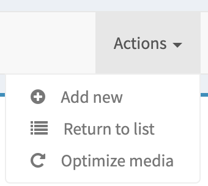

# Add an action to optimize media
To add a new action in your sonata admin.



## Implementation

# Mandatory
First, to enable the extension, you have to declare it into `sonata_admin.yaml`:
```
    extensions:
        ekino.tiny_png_sonata_media.extension.optimize:
            admins:
                - sonata.media.admin.media
```

Keep in mind you have to add the following parameter in `sonata_media.yaml` config for example (to be well used by SonataMediaAdmin service):
```
parameters:
    sonata.media.admin.media.controller: ekino.tiny_png_sonata_media.controller.media_admin
```

Use `ekino.tiny_png_sonata_media.controller.media_admin` or the service id of your own Controller.

# Optional
Two options to use this action, you could use your own Controller and extend the `Ekino\TinyPngSonataMediaBundle\Controller\MediaAdminController`.

Or use directly the `Ekino\TinyPngSonataMediaBundle\OptimizeImageTrait` in your Controller:
```php
<?php

namespace App\Controller;

use Sonata\MediaBundle\Controller\MediaAdminController as BaseMediaAdminController;
use Ekino\TinyPngSonataMediaBundle\OptimizeImageTrait;

class MediaAdminController extends BaseMediaAdminController
{
    use OptimizeImageTrait;
}
```
